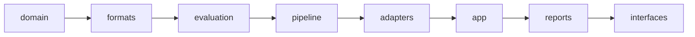
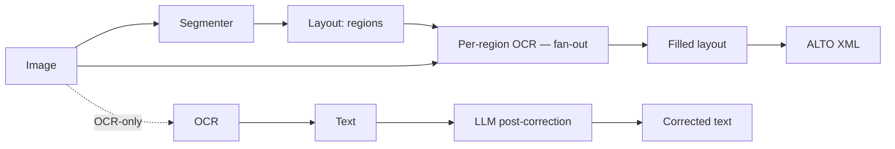

<div align="center">

# Cinoc

[](https://github.com/maribakulj/cinoc/actions/workflows/ci.yml)
[](https://www.python.org/)
[](LICENSE)
[](#development)
[](https://github.com/astral-sh/ruff)
[](https://mypy-lang.org/)
[](#invariants)

**A deterministic benchmark for transcription *pipelines* — OCR, HTR, VLM, OCR→LLM — on heritage documents.**

Cinoc runs competing transcription pipelines over a ground-truth corpus and produces a **factual, quantified verdict** — metrics plus statistical tests — as a **self‑contained interactive HTML report**. No LLM writes the report: every number is an **auditable** function of the inputs.

</div>

---

## Why Cinoc exists

Transcribing heritage documents — medieval manuscripts, early printed books, 19th‑century press — is no longer a single OCR call. It is a **pipeline**, and AI has multiplied the ways to build one:

- an **OCR** engine feeding an **LLM** post‑corrector — does the LLM *fix* errors, or *invent* plausible text the original never contained?
- a **VLM** transcribing straight from the image, with or without **layout segmentation** first;
- a **post‑correction LLM** paired with **anti‑hallucination** measurement — how much does it rewrite that was already correct?

Existing OCR benchmarks were not built for this. They assume one engine, clean modern text, and a single error rate. Heritage material breaks all three assumptions, and **AI breaks the metrics themselves**:

- **CER/WER are no longer enough.** A pipeline can lower the character error rate while *hallucinating* named entities, destroying diacritics, modernising archaic spellings, or mangling dates and folio numbers — exactly the things a historian actually cites.
- **A pipeline that wins on one corpus loses on another.** What is best for 19th‑century print is not what is best for a 15th‑century hand.
- **The "best" pipeline depends on who is asking.** An institution may weigh **cost**, **throughput**, results **per region** vs **per page**, or robustness on a specific stratum — differently. Cinoc never declares a winner; it gives you the numbers and the significance tests, and the judgement stays yours.

Cinoc is the bench you run **before** committing a corpus to a pipeline: reproducible, engine‑agnostic, and honest about what it does and does not measure.

*(Screenshots are at the [bottom of this page](#screenshots).)*

---

## What you can build and measure

### Pipelines (composed, not hard‑wired)

| Pipeline | What it does |
|---|---|
| **OCR / HTR** | Tesseract · Kraken · Pero · Calamari · Mistral OCR · Google Vision · Azure Document Intelligence |
| **OCR → LLM** (`text_only`) | an OCR engine, then an LLM corrects the text |
| **OCR → VLM** (`text_and_image`) | an OCR engine, then a VLM sees **image + text** together |
| **VLM zero‑shot** | a VLM transcribes the image directly, no OCR upstream |
| **Image preprocessing** (`image → image`) | deskew and binarise before reading, so you can measure whether restoring the page actually lowers the error rate — instead of asserting it from a quality score. The angle is **searched**, the threshold is **computed from the image** (Otsu); no magic constant decides anything. |
| **Reading order** (`layout → layout`) | put the blocks back in the order a human reads them. On a two‑column page, reading top‑to‑bottom interleaves the columns and the text becomes unusable — a dedicated metric (Kendall distance) attributes that damage to the *ordering*, where CER alone cannot tell it apart from a bad transcription. |
| **Hybrid** (seg → reco → ALTO) | layout segmentation → recognition **per region** (fan‑out) by **any OCR or a VLM (zero‑shot) per block** → assembled ALTO XML |
| **Structured post‑correction** (ALTO → ALTO) | take **existing** ALTO and correct it *inside* the layout — every line keeps its identifier, so before/after is **known**, not guessed by aligning two lists of lines. Rules (offline, deterministic) or a local LLM via Ollama. |
| **Chained correction** (`corrected_text → corrected_text`) | a second corrector picks up where the first left off — a fast pass then a careful one, or structured correction then textual. The `refine` mode is the only one whose input *and* output are corrected text, which is what makes a chain expressible at all. |
| **+ NER** (optional terminal step) | `text → entities`, scored if the corpus carries entity ground truth |

Engines are **interchangeable bricks** behind a single `Module` protocol. Heavy dependencies are **optional extras**: an engine is always listed, and tells you clearly if it needs its extra or API key instead of crashing.

### Metrics (built for the AI era)

Far beyond CER/WER — every family ships with its own report section and tests against externally‑computed values:

- **Character / word** — CER, diplomatic CER, WER, MER, median/min/max, Gini concentration.
- **Philology** — diacritics, MUFI (Medieval Unicode) overlap, abbreviations, early‑modern forms, modern‑archive conventions, Roman numerals, archaism rates (AIR/HCPR).
- **HIPE conformity** — cMER under the HIPE‑OCRepair norm, micro/macro, JSONL export.
- **Correction balance** *(the "did the LLM help?" family)* — improvement/regression/no‑change triplet, pcis, change ratio (CCR), **over‑normalisation** (correct words the corrector degraded), heavy‑insertion / **hallucination** flags, consecutive‑edit runs, worst regressions. When the corrector reports its own **decisions**, the report also shows what it *refused* to change, and why — a refusal is a result, not a silence.
- **Line identity** — when a pipeline preserves line identifiers (structured post‑correction), before/after are matched **by id** instead of being guessed by alignment: per‑line CER and coverage stop depending on a heuristic.
- **Structured data** — survival of dates, foliation, amounts, regnal years (strict form *and* equivalent value).
- **Textual fidelity** — rare‑token recall, lexical modernisation flow.
- **Named entities (NER)** — precision/recall/F1 per category, missed & hallucinated entities, IoU span matching in GT coordinates.
- **Inter‑engine** — Jensen‑Shannon divergence, oracle gap, complementarity; **Wilcoxon / Friedman / Nemenyi** significance and bootstrap CIs.
- **Per‑line distribution** — percentiles, Gini, catastrophic‑line rate, positional heat‑map.
- **Calibration** — ECE / MCE on engine confidences.
- **Image quality** — sharpness, noise, contrast, skew (per document).
- **Economics** — **measured** tokens × dated price table + **measured** wall‑clock → cost and effective throughput, Pareto fronts, marginal cost per avoided error (no invented CO₂, no estimates).
- **Longitudinal** — OLS trend + Pettitt change‑point across runs (on the `/history` page).

> Levels that don't apply return **`None`**, never a misleading `0` — an absent measurement is reported as absent.

---

## Invariants

- **Deterministic** — same spec + same corpus + same code → identical artifacts (same hash), identical metrics, identical report.
- **Reproducible** — every run carries a `RunManifest` (code version, dependency versions, engine binaries, parameter fingerprint).
- **Anti‑hallucination** — no LLM writes a single word of the report; every figure is an auditable function of the inputs.
- **Secure** — hardened XML (`safe_parse_xml`: no DTD/DOCTYPE/external entity/network), all user paths validated (anti‑traversal), anti‑SSRF on remote fetches, and an **opt‑in** public *fail‑closed* mode for protecting a key on a public Space (only the free base runs).

---

## Architecture — eight concentric layers

A layer may import **only** layers more internal than itself. This is enforced mechanically by the architecture test‑suite. The envelope is dimensioned for the full scope; surface (engines, metrics, renderers) is filled in incrementally.



| Layer | Role |
|---|---|
| **domain** | pure types & contracts (Pydantic, frozen) — `Artifact`, `PipelineSpec`, `RunResult`, `RunManifest`, `CanonicalLayout` |
| **formats** | ALTO / PAGE / text parsing & writing, XML hardening, normalisation profiles |
| **evaluation** | metrics, statistical tests, projectors, the `RunResult` assembler — pure compute, no I/O |
| **pipeline** | the executable `Module` protocol, cooperative cancellation/deadline, **region fan‑out** |
| **adapters** | engine wrappers (OCR/HTR/VLM/LLM), segmenters, storage, corpus importers |
| **app** | orchestration, run planning, job runner, corpus & report stores |
| **reports** | the self‑contained interactive HTML report (server‑rendered SVG, zero compute JS) |
| **interfaces** | thin transport — CLI and the FastAPI web app / HF Space |

A transcription pipeline is composed declaratively and executed left‑to‑right:



---

## Installation

Requires **Python ≥ 3.11**.

```bash
pip install -e ".[dev]"          # core + dev tooling
pip install -e ".[dev,serve]"    # + local web app
```

Heavy dependencies are **optional extras** — install only what you use:

| Brick | Extra | Notes |
|---|---|---|
| Tesseract (OCR) | `[tesseract]` | the `tesseract` binary is required |
| Kraken · Pero · Calamari (local HTR/OCR) | `[kraken]` `[pero]` `[calamari]` | not deployed on the Space |
| OpenAI · Anthropic · Mistral · Ollama (LLM/VLM) | `[openai]` `[anthropic]` `[mistral]` `[ollama]` | API key |
| Google Vision · Azure Document Intelligence | `[google]` `[azure]` | REST, API key |
| PP‑DocLayout segmenter (local) | `[segment]` | PaddleX + weights |
| Image preprocessing | `[images]` | Pillow to decode; the maths are plain numpy |
| Named‑entity step (NER) | `[ner]` | spaCy + a model (`spacy download …`) |
| Structured post‑correction (ALTO → ALTO) | `[saknussemm]` | installed from its repository — not on PyPI yet |
| HuggingFace import / publish | `[huggingface]` | `datasets` + `huggingface_hub` |
| Real report thumbnails | `[images]` | Pillow (graceful fallback without) |

A remote segmenter needs no local extra — it delegates to a HuggingFace object‑detection endpoint (swap the model by swapping the URL).

---

## Quickstart

```bash
cinoc demo  --output report.html                 # demo report, no engine required
cinoc corpus import gallica ark:/12148/bpt6k5619759j  # fetch a corpus, write corpus.yaml
cinoc run   config.yaml --check                  # validate + print the plan, run nothing
cinoc run   config.yaml -o report.html           # run a benchmark described in YAML
cinoc run   config.yaml --report-dir bundle/     # folder report (HTML + separate images)
cinoc run   config.yaml --json run.json          # also export the machine-readable RunResult
cinoc run   config.yaml --alto-dir alto/         # also keep the ALTO the run produced
cinoc hybrid images/ --out alto/                 # segment → per-block OCR → one ALTO per page
cinoc hybrid images/ --segment-only --out seg/   # stop at the layout, one LAYOUT per page
cinoc correct alto/ -o report.html               # post-correct existing ALTO, inside the layout
cinoc compare a.json b.json -o diff.html         # compare two runs (deltas)
cinoc history runs.db --pipeline tesseract       # one pipeline's series over time
cinoc history runs.db --threshold 0.01           # or: which pipelines regressed
cinoc serve --port 8080                          # local web app
```

### Knowing what your install can do

The `/engines` page, the composer's model dropdowns and the normalisation preview all read probes that live in the `app` layer. `cinoc list` reads the same ones, in text:

```bash
cinoc list engines                 # engines, segmenters, NER — and *why* one is unavailable
cinoc list models anthropic        # canonical model suggestions, vision flagged
cinoc list profiles                # the normalisation profiles
cinoc list prompts                 # the curated period prompts
```

An unavailable engine is never hidden: it says what it needs — an extra, a binary, an API key — instead of quietly not being there.

A profile is judged on a text, not on its name, so you can try one before committing a run to it:

```bash
cinoc list profiles --preview "Il eſtoit vne fois" --profile heritage
cinoc list profiles --preview "ABC" --config my-normalisation.yaml
```

Nothing is persisted — a custom config is applied on the fly, exactly as in the web preview.

### The run config

`cinoc run` takes a full `RunSpec` in YAML — a corpus, candidate pipelines, and the views that score them. A **runnable, commented example** ships with the repo:

```bash
cinoc run examples/config.yaml --check     # read the plan first
cinoc run examples/config.yaml -o report.html
```

It needs **no engine and no network**: it replays frozen outputs through `precomputed`, so it works before you install anything. Swap `precomputed:<label>` for `tesseract`, `openai`, `kraken`… for a real run. A test loads *and runs* every example in `examples/`, so they cannot go stale.

Two flags worth knowing. `--check` validates the file and prints what would run without executing it — a benchmark spec commits billed API calls and hours of compute, so reading it first is not a luxury. `--alto-dir` keeps the ALTO a run produced: without it, an ALTO your spec asked for dies with the temporary workspace.

`cinoc hybrid --segment-only` stops after segmentation and writes one `<doc>.layout.json` per page — exactly what `precomputed_layout` reads back, so you can segment once and then compare several recognisers on the same layout.

### Getting a corpus

Everything the web app can fetch, the CLI can fetch — same importers, same code, different destination. The web materialises into a server-side store; `cinoc corpus` materialises into **a folder you choose**, next to a `corpus.yaml`:

```bash
cinoc corpus import iiif <manifest-url>       --dest corpus/   # any IIIF manifest
cinoc corpus import gallica ark:/12148/...    --dest corpus/   # Gallica, --no-ocr to skip its OCR
cinoc corpus import escriptorium <url> <pk>   --token ...      # an eScriptorium document
cinoc corpus import hf <owner/dataset>        --split train    # a HuggingFace dataset
cinoc corpus import curated <owner/dataset>   --revision ...   # a curated Cinoc dataset, pinned
cinoc corpus import zip corpus.zip                             # a local archive

cinoc corpus search "presse"        # the HTR-United catalogue
cinoc corpus discover               # your own curated datasets on HuggingFace
```

The written `corpus.yaml` holds the `corpus:` key of a run config, with **paths relative to itself** — move or archive the folder and it still resolves. Complete it with `pipelines:` and `evaluation:`, or paste its block into an existing config, then `cinoc run` it.

Two flags carry the honesty of the measurement: `--no-ocr` on Gallica (its OCR is OCR, not a verified transcription — importing it as ground truth changes how every score reads), and `--revision` on a curated dataset (pins the exact data a run was measured against).

An import is **atomic**: if it fails halfway — network, non-conforming source — the partially materialised folder is removed rather than left as a half corpus.

`cinoc correct` takes a folder of `<name>.xml` + `<name>.png` pairs and benchmarks a post‑corrector on them. Two options carry the honesty of the measurement:

```bash
cinoc correct alto/ --ocr-sidecar ocr.json       # feed it real OCR, not the ground truth
cinoc correct alto/ --repeat 5                   # publish a range, never a lone decimal
```

`--ocr-sidecar` matters on a **ground‑truth** corpus: without it the source reads the reference, the corrector has nothing to correct, and the CER is zero *by construction* — a tautological zero that looks like an excellent result. `--repeat` runs the same configuration *n* times and writes the spread beside the report: a model at temperature 0 is not deterministic, so any comparison tighter than the widest spread is noise. Use `--producer ollama --model <name>` for a local LLM instead of the offline rules.

---

## The web app & HuggingFace Space

`cinoc serve` (or the hosted Space) gives you the interactive surface:

- **Library** — prepare a corpus: drag‑and‑drop ZIP upload, or import from **IIIF / Gallica / eScriptorium / HuggingFace / HTR‑United**. Your curated Cinoc datasets (tagged `cinoc-corpus`) appear **automatically** — your handle is resolved from the Space (`SPACE_ID`) or an HF token, with `CINOC_HF_AUTHOR` as an explicit override; images stay as revision‑pinned remote references (a static‑IIIF layout served from the HF repo), fetched automatically — SSRF‑hardened, size‑capped — when a run needs the pixels.
- **Benchmark** — the composer: pick a corpus, add competitors (OCR, OCR→LLM, VLM, **Hybrid**), launch (live progress over SSE). The **Hybrid** mode composes *segmenter → per‑region OCR/VLM → assembled text*, scored side‑by‑side with flat pipelines; a **layout preview** panel shows the detected regions before you launch. (There is no separate segmentation tab — it lives here.)
- **Structured post-correction** — point it at a corpus of existing ALTO and correct it *inside* the layout, with the same producers as `cinoc correct` (offline rules, or a local LLM through Ollama). The corpus must carry a **separate** transcription beside its ALTO: without one the reference is extracted from the ALTO itself, the corrector would start from the very text it is scored against, and the launcher refuses the run rather than publish a meaningless number.
- **Reports / History** — browse rendered reports and longitudinal trends.

By default an instance runs its engines with the operator's own key (no gate). The **opt‑in** public mode (`CINOC_PUBLIC_MODE=true`) makes a deployment *fail‑closed* — only the free first‑party base (Tesseract — no key, no billed call) runs; cloud engines and third‑party plugins are refused (`403`) — for protecting a key on a *public* Space. See [`deploy/`](deploy/) for the HuggingFace Space image.

Report **flavors**, four of them, differing only in *where the pixels come from* — the report itself just receives `{document: href}`:

| Flavor | Images | For |
|---|---|---|
| **Single file** | inlined base64 | one file to archive or email; capped at a few hundred documents |
| **Folder / ZIP** | written beside the HTML | offline reading at any size (`cinoc run --report-dir`, or the web download) |
| **IIIF / HF references** | fetched from the published dataset | a light HTML over pinned remote data |
| **Served** | produced on demand by the web app | **runs of thousands of pages** — no cap, nothing pre-encoded, the browser loads only what it shows |

The served flavor is what `GET /reports/{name}` uses: the gallery is paginated and every card is lazy, so a 5000-page run opens without a 50 MB download and without silently dropping the previews past the cap. The report is **bilingual FR/EN** (`?lang=en`).

---

## Extensibility — one public socket, by design

The **only** public extension point is the **pipeline brick** (segmenter, OCR/HTR, VLM, post‑corrector, ALTO builder, NER…). A pip package exposing a `cinoc.modules` entry‑point is discovered at runtime (fail‑closed in public mode). Everything else — metrics, importers, report sections, statistical tests — is first‑party and intentionally **not** pluggable: a single, stable socket rather than many.

---

## Development

```bash
make check-fast   # ruff + mypy --strict + the whole test suite (pre-push)
make lint         # ruff
make type         # mypy
make test         # pytest (parallel)
make ci           # full gate, with coverage threshold
```

CI runs on Linux/macOS/Windows × Python 3.11/3.12/3.13 and enforces the coverage threshold. Detailed roadmap and decision log: [`MIGRATION_PLAN.md`](MIGRATION_PLAN.md); notable changes: [`CHANGELOG.md`](CHANGELOG.md); working contract: [`CLAUDE.md`](CLAUDE.md).

---

## Screenshots

<details open>
<summary><strong>The report</strong> — one self‑contained HTML file: per‑engine scores, heat‑mapped per‑view metrics, corpus strata, comparison & significance, drill‑in by document, CSV/JSON export.</summary>


</details>

<details>
<summary><strong>The benchmark composer</strong> — compose competitors (OCR, OCR→LLM, OCR→VLM image+text, VLM zero‑shot), toggle a NER step or ALTO export, pick a normalisation profile, launch.</summary>


</details>

<details>
<summary><strong>Layout & hybrid transcription</strong> — segment a page, then transcribe block by block (segmentation → per‑region OCR/VLM → assembled ALTO). Degrades gracefully when an engine is unavailable.</summary>


</details>

---

## The name

*Cinoc* is a nod to a character in the fiction of **Georges Perec**.

## License

Apache‑2.0.
